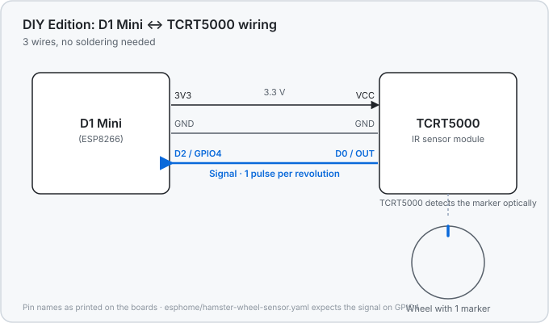

# Hamster Fitness — Hardware

[](LICENSE)

> **This is the hardware repository.** It contains the physical wheel
> sensor, 3D-printed enclosure, PCB/wiring notes, and ESPHome firmware for
> [Hamster Fitness](https://github.com/GpsM2/ha-hamster-fitness-integration)
> — a free Home Assistant integration that turns your hamster's running
> wheel into a health score, distance tracking, and more. **The Home
> Assistant integration itself lives in a separate repository:
> [ha-hamster-fitness-integration](https://github.com/GpsM2/ha-hamster-fitness-integration).**

> This repo ships the **DIY Edition** — a starter kit built from cheap,
> standard parts, and the target the ESPHome code here is written for.

## License

This project uses the
[Creative Commons Attribution-NonCommercial 4.0 International license](LICENSE)
(CC BY-NC 4.0): anyone can use, adapt, and share these designs and this
firmware for free, for **non-commercial** purposes (personal use, hobby
projects, schools, research) — with attribution. The author (GpsM2)
keeps full rights and may also use or license the project commercially.
(The software repo uses a different, permissive license — see its
README.)

## What's here

- **`esphome/`** — ESPHome YAML firmware for the wheel-rotation sensor.
- **`cad/`** — OpenSCAD/STL/STEP files for the 3D-printed enclosure
  (nothing here yet).
- **`pcb/`** — schematics/KiCad files, if this ever moves past a
  hand-wired build (nothing here yet).
- **`docs/`** — build guides and bills of materials.

## 🐹 DIY Getting Started Guide (DIY Edition)

This is the fastest way to a working wheel sensor: cheap, off-the-shelf
parts, no soldering required (jumper wires are enough), and no special
tools. If you've
ever wired up an Arduino or Raspberry Pi project, this is easier — and
a fun first smart-home build to do together with kids.

**Parts:**

- An ESP8266 board — "ESP-12F" / "D1 Mini" (a few euros, widely
  available — e.g. [BerryBase (DE)](https://www.berrybase.de/en/d1-mini-esp8266-entwicklungsboard);
  see [docs/diy-edition-parts-list.md](docs/diy-edition-parts-list.md)
  for more sources, including the US)
- A TCRT5000 infrared reflective sensor module — optical, so no
  magnets to glue to the wheel and nothing a hamster can chew through
- Jumper wires and a small breadboard (or a 3D-printed mount, see
  `cad/`)

<figure>
  
  <figcaption>D1 Mini ↔ TCRT5000 wiring — 3 wires, no soldering. A KiCad version of this is in <a href="pcb/diy-edition-wiring.kicad_sch"><code>pcb/diy-edition-wiring.kicad_sch</code></a>.</figcaption>
</figure>

**Steps:**

1. Wire the TCRT5000 module to the ESP8266: signal/`D0` → `D2`
   (GPIO4), plus `VCC` → `3V3` and `GND` → `GND` (see diagram above).
2. Open `esphome/hamster-wheel-sensor.yaml` in ESPHome and flash it to
   your board — this config is written and tuned specifically for
   this ESP8266 + TCRT5000 setup, so there's nothing else to configure.
3. Add these four entries to your ESPHome `secrets.yaml`:

   ```yaml
   wifi_ssid: "YourNetwork"
   wifi_password: "your-wifi-password"
   api_encryption_key: "..."   # 32-byte base64 key, see below
   ota_esphome_key: "pick-anything-you-can-remember"
   ```

   ESPHome generates a suitable `api_encryption_key` for you — in the
   ESPHome dashboard it appears when you create a device, or you can
   copy one from an existing device's config. The OTA key is simply a
   password you choose; you need it again for wireless re-flashing.
4. Mount the sensor next to the wheel so it "sees" one mark (e.g. a
   strip of tape or a printed marker) once per full turn.
5. Once it's flashed, Home Assistant should find it automatically
   through the ESPHome integration.
6. Install [ha-hamster-fitness-integration](https://github.com/GpsM2/ha-hamster-fitness-integration)
   and point it at this sensor's rotation-count entity.

## Firmware versions

The firmware carries a version number, and Home Assistant shows it as the
device's firmware version — Settings → Devices & Services → ESPHome, or
the device page itself. It comes from the `project:` block at the top of
[`esphome/hamster-wheel-sensor.yaml`](esphome/hamster-wheel-sensor.yaml).

**That number always matches a [release](../../releases) of this
repository.** So if your device reports `1.0.0`, you are running exactly
what the `v1.0.0` release contains, and you can read that release's notes
to see what changed since the version you had before. There is no
auto-update: re-flashing is a deliberate step, which is why knowing what
is actually on the board matters.

Contributing a firmware change? Bump `project.version` in the same pull
request, and the release gets cut with the matching tag.

## Support this project

Hamster Fitness is free and always will be. If it's useful to you and you
want to say thanks, you can [buy me a coffee on Ko-fi](https://ko-fi.com/R8O124JOD1).
Not required — just appreciated.
